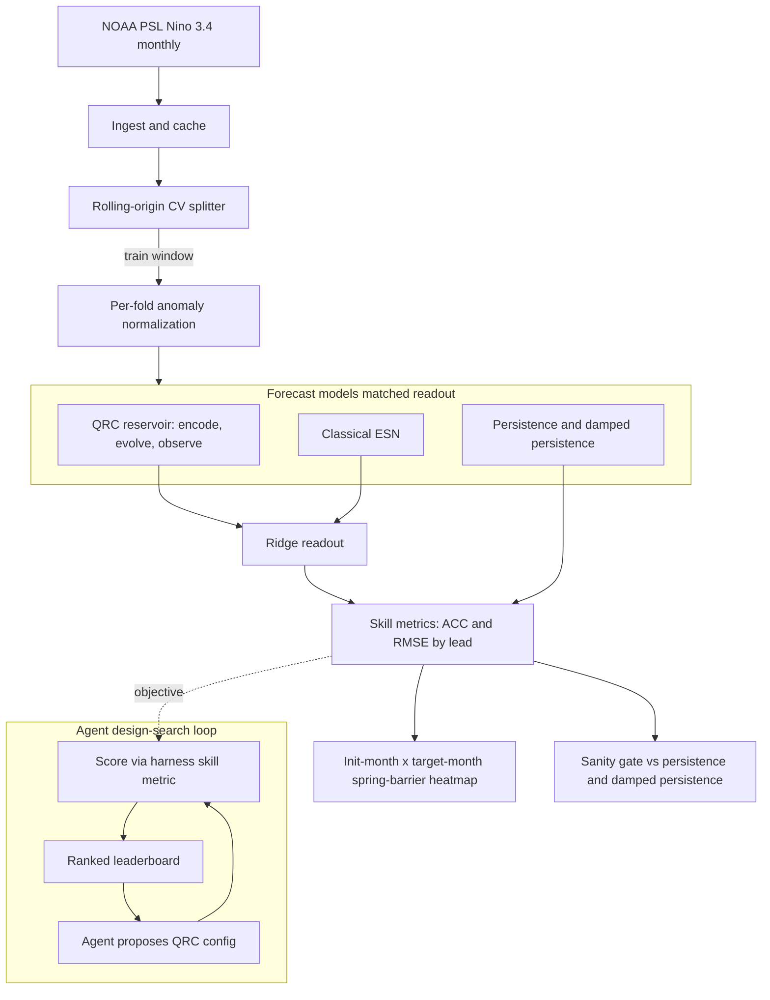

# feat: QRC ENSO forecasting walking-skeleton pipeline

## Summary

Build a Python pipeline that forecasts the monthly Niño 3.4 ENSO index with a quantum reservoir, compares it fairly against persistence and a tuned classical Echo State Network, and evaluates skill with leakage-safe rolling-origin cross-validation. The evaluation harness is built first and stays pluggable so an "advantage axis" can be run next; an AI-agent reservoir-design search loop wraps the harness once the fixed-config skeleton runs.

---

## Problem Frame

Quantum reservoir computing (QRC) is one of the few quantum-ML methods plausible on near-term hardware — the reservoir is fixed (untrained), so noise is partly absorbed rather than corrupting a delicate circuit, and only a linear readout is trained. Prior work has demonstrated QRC on synthetic chaotic benchmarks (NARMA, Lorenz) but not on real geophysical data. ENSO / Niño 3.4 is a canonical chaotic time series with a long public record, strong baselines, and a built-in hard sub-problem (the boreal-spring predictability barrier).

The risk this plan manages is not "can we run QRC" but "can we compare it honestly." Classical ESNs already forecast ENSO well and cheaply, and the QRC-vs-classical literature is littered with unfair comparisons (untuned baselines, mismatched feature dimensions, anomaly-normalization leakage). The walking skeleton therefore prioritizes a rigorous evaluation harness over QRC sophistication: prove a *sane* forecast and a *fair* comparison, then iterate on the advantage axis (see origin: `2026-06-17-qrc-enso-forecasting-brainstorm.md`).

---

## Requirements

**Data and leakage safety**
- R1. The pipeline ingests the monthly Niño 3.4 index from NOAA PSL and produces a reproducible, locally-cached, version-pinned dataset.
- R2. Anomalies are computed from a climatology (mean and standard deviation) derived only from each fold's training window — never the full record or any test span.

**Forecasting and models**
- R3. The system forecasts the Niño 3.4 anomaly at lead times of 1, 3, 6, 9, and 12 months.
- R4. Baselines include persistence, damped persistence, and a hyperparameter-tuned classical ESN with a ridge readout.
- R5. The QRC model encodes the series into a fixed quantum reservoir and trains only a linear (ridge) readout on measured observables.
- R6. QRC and ESN are compared at matched readout feature dimension; reservoir size, qubit count, virtual-node count, and readout dimension are each reported.

**Evaluation**
- R7. Skill is evaluated with rolling-origin (expanding-window) cross-validation; shuffled or k-fold splits are never used.
- R8. Reported metrics are Anomaly Correlation Coefficient (ACC) and RMSE as functions of lead time, plus an init-month × target-month skill heatmap that exposes the spring predictability barrier.
- R9. A sanity gate checks that the QRC forecast beats persistence and lands within range of damped persistence and the ESN; results below that bar are reported honestly, not suppressed.
- R12. The harness exposes a pluggable "advantage axis" interface (footprint efficiency, data efficiency, spring-barrier skill) so a chosen axis runs without reworking the comparison.

**Agent design-search loop**
- R10. An agent-driven loop proposes QRC reservoir configurations, scores each through the evaluation harness, and records a ranked leaderboard of configs and their skill.
- R11. The search loop reuses the same leakage-safe CV and matched-comparison rules as the fixed-config experiment.

---

## Key Technical Decisions

- QRC simulation via **QuantumReservoirPy on Qiskit Aer**: it is purpose-built for QRC time-series and ships Static and Incremental (temporal-multiplexing) reservoir modes, avoiding a hand-rolled injection/evolve/readout loop. Its feature path is shot-based (`get_counts()`); the adapter adds the seeded/exact-expectation path Aer makes available and trains direct per-lead readouts (the library's own `predict()` is a recursive autoregressive rollout that does not match the harness contract). Wrapped behind an adapter so the research-grade dependency can be swapped. (Alternative: PennyLane, more flexible for a differentiable search but more boilerplate for fixed-circuit QRC — rejected for v1.)
- Classical ESN via **reservoirpy with a matched ridge readout and `hyperopt` tuning**: the ridge readout is identical to the QRC readout, and joint tuning of spectral radius, leak rate, input scaling, and ridge defeats the untuned-baseline trap.
- **Per-fold, training-window-only anomaly normalization**: the specific ENSO leakage trap. Base-period choice materially changes anomaly magnitudes, so climatology is recomputed inside each fold from training data alone.
- **Rolling-origin expanding-window CV**, minimum ~25-year initial training window, advancing by a 6-month stride: ENSO multi-year autocorrelation makes shuffled/k-fold splits leak, and a 6-month stride yields enough samples per initialization month to populate the spring-barrier heatmap.
- **Matched feature dimension**: QRC readout dimension (qubits × virtual nodes, plus optional 2-qubit correlators) is matched to ESN units; all counts are reported separately so capacity differences cannot masquerade as architectural advantage.
- **Black-box (non-differentiable) agent search**: the quantum reservoir is sampled and read out via expectation values, so it is not differentiable. The agent proposes configs and the harness scores them — config search, not gradient descent — which is consistent with the Aer/QuantumReservoirPy stack.
- **Incremental (multiplexed) injection as default**, with restart noted as a more hardware-friendly variant: continuous injection scores better on memory capacity; restart is deferred to the cloud-QPU follow-up.

---

## High-Level Technical Design

The data path is shared by every model; only the reservoir block differs. The agent loop wraps the same harness, treating its skill metric as a black-box objective.



---

## Output Structure

```
pyproject.toml
qrc_enso/
  __init__.py
  data.py          # U2  ingestion + leakage-safe anomalies
  evaluation.py    # U3  CV, metrics, spring-barrier, advantage-axis interface
  baselines.py     # U4  persistence, damped persistence, tuned ESN
  qrc.py           # U5  quantum reservoir adapter + ridge readout
  experiment.py    # U6  matched-comparison runner + sanity gate
  search.py        # U7  agent design-search loop + leaderboard
tests/
  test_smoke.py
  test_data.py
  test_evaluation.py
  test_baselines.py
  test_qrc.py
  test_experiment.py
  test_search.py
scripts/
  run_baseline_experiment.py
  run_design_search.py
data/                # cached NOAA snapshot (gitignored)
results/             # skill tables, figures, leaderboards (gitignored)
```

The per-unit `**Files:**` lists are authoritative; this tree is the expected shape, adjustable during implementation.

---

## Implementation Units

### U1. Project scaffolding and environment

- **Goal:** Stand up the Python project, dependency set, and package skeleton so later units have a home.
- **Requirements:** Enables R1–R12.
- **Dependencies:** none.
- **Files:** `pyproject.toml`, `qrc_enso/__init__.py`, `.gitignore`, `tests/test_smoke.py`.
- **Approach:** Pin `qiskit-aer`, `quantumreservoirpy`, `reservoirpy[hyper,sklearn]`, `scikit-learn` (within `>=0.24.2,<1.7.0`, the window `reservoirpy[sklearn]` requires), `numpy`, `pandas`, plus a test runner. The ESN tuner and ridge backend live in reservoirpy's `hyper`/`sklearn` extras, so the bare package is insufficient. No `climpred`/`xarray` — ACC/RMSE and the heatmap are computed directly with numpy/pandas (see U3). Gitignore `data/` and `results/`. Keep module files as stubs with typed signatures the later units fill in.
- **Patterns to follow:** Standard `pyproject.toml` + `src`-less flat-package layout; no framework conventions to mirror (greenfield).
- **Test scenarios:** A smoke test imports every `qrc_enso` module and asserts the pinned third-party packages import at their expected versions. `Test expectation: none for behavior -- scaffolding only; the smoke import test guards the environment.`
- **Verification:** Fresh environment install succeeds and the smoke test passes.

### U2. Data ingestion and leakage-safe anomaly pipeline

- **Goal:** Fetch, cache, and version the Niño 3.4 index and expose a fold-aware anomaly transform.
- **Requirements:** R1, R2.
- **Dependencies:** U1.
- **Files:** `qrc_enso/data.py`, `tests/test_data.py`.
- **Approach:** Download the **raw monthly Niño 3.4 SST series** from NOAA PSL (`https://psl.noaa.gov/data/correlation/nina34.data`, not the pre-computed `nina34.anom.csv` — that file is already anomalized against a fixed base period and would defeat per-fold normalization). Drop the documented missing-value sentinels (`-99.99` / `-9999.000`, which pad pre-1950 and not-yet-observed future months) and trim trailing future months before the series is considered valid. Persist a timestamped snapshot under `data/`. Provide an anomaly transform that computes climatology mean/std from a training index range only, then applies it to any target span; reserve `nina34.anom.csv` only as a cross-check. The transform is a fitted object (fit on train, apply to test), not a whole-series operation.
- **Execution note:** Implement the anomaly transform test-first — leakage is the central correctness risk and is invisible without a guarding test.
- **Patterns to follow:** scikit-learn fit/transform separation for the normalizer.
- **Test scenarios:**
  - Ingestion writes a cached snapshot and a second load reads the cache without re-downloading.
  - Sentinel rows (`-99.99` / `-9999.000`) and trailing future months are dropped; ingesting them as real values would corrupt climatology and skill metrics.
  - After cleaning, the loaded series is monthly, gap-free over its covered range, and spans at least 1950–present.
  - Covers R2. Fitting the anomaly transform on 1950–1999 yields climatology statistics that are byte-identical whether or not 2000–2020 data is present in the input — proving the test span cannot influence normalization.
  - Applying a transform fitted on one window to a disjoint later window produces anomalies using the earlier window's mean/std (assert against a hand-computed value).
  - Requesting an anomaly for a date outside the loaded range raises rather than silently extrapolating.
- **Verification:** The leakage test (R2) passes and a cached snapshot exists under `data/`.

### U3. Evaluation harness: CV, skill metrics, spring barrier

- **Goal:** Provide the rolling-origin splitter, skill metrics, spring-barrier figure, and the pluggable advantage-axis interface every model is scored through.
- **Requirements:** R3, R7, R8, R12.
- **Dependencies:** U1, U2.
- **Files:** `qrc_enso/evaluation.py`, `tests/test_evaluation.py`.
- **Approach:** Implement an expanding-window splitter (configurable initial train length and stride) yielding (train range, origin, multi-lead target months). Compute ACC (anomaly correlation) and RMSE per lead time, and the (init-month, target-month) heatmap, directly with numpy/pandas — both are a few lines (the heatmap is a `groupby(['init_month','target_month'])` mean-pivot), so no xarray/hindcast framework is pulled in. Define an `AdvantageAxis` protocol (satisfying R12) with **no concrete implementations yet** — the chosen axis ships with the follow-up work, not as v1 dead code. A model is anything exposing fit(train) / predict(origin, lead), where predict returns a **direct** forecast at the requested lead.
- **Patterns to follow:** A strategy/protocol interface for advantage axes; standard pandas pivot for the skill heatmap.
- **Test scenarios:**
  - Covers R7. The splitter never includes any target month at or after the forecast origin in a training window (assert no train index ≥ origin across all folds).
  - The splitter honors the configured initial-train minimum and stride, and produces ≥ 3 samples per initialization month at the default stride.
  - ACC and RMSE match hand-computed values on a tiny synthetic series with a known correlation to its target.
  - Covers R8. The heatmap output is indexed by (init-month, target-month) and a synthetic series with deliberately degraded March–May targets shows the expected diagonal skill trough.
  - The advantage-axis protocol accepts a caller-supplied one-method object and round-trips it through the harness without modifying harness internals (no concrete axis ships in v1).
- **Verification:** CV no-leakage test (R7) passes and the spring-barrier heatmap renders from a synthetic input.

### U4. Classical baselines

- **Goal:** Provide persistence, damped persistence, and a fairly-tuned ESN as the comparison floor and the real competitor.
- **Requirements:** R3, R4, R6.
- **Dependencies:** U2, U3.
- **Files:** `qrc_enso/baselines.py`, `tests/test_baselines.py`.
- **Approach:** Persistence repeats the last observed anomaly across all leads; damped persistence decays it toward climatology with a decay timescale **fitted per fold on training data only** (a global fit would leak, violating R2). The ESN uses reservoirpy (`Reservoir >> Ridge`) with joint hyperparameter search over spectral radius, leak rate, input scaling, and ridge via reservoirpy's `hyperopt` integration, searched only on training folds. Forecasting is **direct per-lead**: train a separate readout per lead horizon rather than reservoirpy's recursive autoregressive rollout, so predict(origin, lead) returns the target-lead forecast the harness contract expects. Each baseline exposes the same fit/predict interface U3 consumes.
- **Execution note:** Tune the ESN before any QRC comparison is reported — an untuned ESN is the primary fairness failure mode.
- **Patterns to follow:** reservoirpy `Reservoir >> Ridge` model graph and its `hyperopt` research utilities.
- **Test scenarios:**
  - Persistence at all leads equals the origin month's anomaly; damped persistence decays monotonically toward zero anomaly as lead grows.
  - Covers R2. The damped-persistence decay timescale is fitted only from the fold's training window; refitting with test months present does not change it.
  - Damped persistence beats raw persistence at leads > ~4 months on the real series (the known ENSO crossover).
  - Covers R4. ESN training is confined to the fold's training window; hyperparameter search never reads target/test months (assert via a spy on the data ranges touched).
  - Covers R6. ESN reservoir `units` can be configured to match a target readout feature dimension, and the configured count is reported in the result record.
  - ESN fit/predict conforms to the harness model interface (round-trips through U3 without adaptation).
- **Verification:** All three baselines run through the U3 harness and produce ACC/RMSE-by-lead curves; damped > raw persistence at long leads.

### U5. QRC reservoir and ridge readout

- **Goal:** Encode the index into a fixed quantum reservoir and read out observables into a trained ridge layer, behind a swappable adapter.
- **Requirements:** R3, R5, R6.
- **Dependencies:** U2, U3.
- **Files:** `qrc_enso/qrc.py`, `tests/test_qrc.py`.
- **Approach:** Wrap QuantumReservoirPy's Incremental (temporal-multiplexed) reservoir on `AerSimulator`. Encode each scalar anomaly as a rotation angle, evolve a fixed disordered circuit, and read 1-qubit (and optionally 2-qubit) expectation values as the feature vector. The library reads features via shot-based `get_counts()` only, so the adapter builds the per-timestep feature matrix from `run()`/state (not the library's recursive `predict()`) and trains a **direct per-lead** ridge readout per horizon, matching the harness predict(origin, lead) contract. Expose qubit count, virtual-node count, shots, and resulting readout dimension as configuration and in the result record. For the determinism test and any exact-expectation use, the adapter runs a **seeded** `AerSimulator` (or a statevector/expectation path it constructs) — expectation values are otherwise stochastic at finite shots. Keep all QuantumReservoirPy calls inside this adapter so the dependency is isolated. Apply a washout/warmup period excluded from readout training.
- **Patterns to follow:** QuantumReservoirPy `before()/during()/after()` hooks for encode/evolve/measure; the Fujii–Nakajima encode-evolve-observe scheme with temporal multiplexing.
- **Test scenarios:**
  - With a seeded simulator (or the adapter's exact-expectation path), a fixed reservoir is deterministic: identical input yields identical features across runs.
  - Feature/readout dimension equals qubits × virtual nodes (plus correlators when enabled), and the reported dimension matches the actual feature matrix width.
  - Covers R5. Only the ridge readout weights change across training; the reservoir circuit parameters are identical before and after fit.
  - The washout period is excluded from readout training (first N timesteps contribute no training rows).
  - Increasing shots reduces run-to-run variance of an expectation-value feature under the noisy simulator (statistical-noise sanity check).
  - QRC fit/predict conforms to the harness model interface and round-trips through U3.
- **Verification:** QRC produces forecasts through the U3 harness on the real series at all five lead times, with reported qubit/virtual-node/readout counts.

### U6. Matched-comparison experiment runner and sanity gate

- **Goal:** Wire QRC and baselines through the harness at matched feature dimension, emit the skill tables and spring-barrier figure, and assert the walking-skeleton success bar.
- **Requirements:** R6, R8, R9.
- **Dependencies:** U3, U4, U5.
- **Files:** `qrc_enso/experiment.py`, `scripts/run_baseline_experiment.py`, `tests/test_experiment.py`.
- **Approach:** Pin the QRC readout dimension first (qubits × virtual nodes, the more constrained side), then configure ESN units so its readout feature dimension matches; run all models through one rolling-origin pass, and write per-model ACC/RMSE-by-lead tables, the init-month × target-month heatmap, and a run manifest (configs, counts, shots, seed) to `results/`. The sanity gate asserts QRC beats persistence at short leads and lands within a configured tolerance of damped persistence; a failing gate is recorded in the manifest, not hidden. This unit is the "skeleton complete" milestone.
- **Patterns to follow:** The U3 harness model interface; reproducible-run manifest with pinned seeds.
- **Test scenarios:**
  - Covers R6. The runner refuses to report a QRC-vs-ESN comparison unless the readout feature dimensions match (or the mismatch is explicitly recorded in the manifest).
  - Covers R9. On a synthetic series where QRC is wired to underperform persistence, the sanity gate flags failure and the manifest records it rather than the run passing silently.
  - Covers R8. A full run emits ACC/RMSE-by-lead tables for every model and one spring-barrier heatmap to `results/`.
  - The run manifest captures every config, count, shot setting, and seed needed to reproduce the run.
  - Re-running with the same seed reproduces identical skill numbers.
- **Verification:** `scripts/run_baseline_experiment.py` produces the skill tables, the heatmap, and a manifest; the sanity gate verdict is present and honest.

### U7. Agent reservoir-design search loop

- **Goal:** Drive an agent loop that proposes QRC configs, scores them via the harness, and ranks them — the active-learning layer over the skeleton.
- **Requirements:** R10, R11, R12.
- **Dependencies:** U3, U5, U6.
- **Files:** `qrc_enso/search.py`, `scripts/run_design_search.py`, `tests/test_search.py`.
- **Approach:** Define a config space (qubit count, virtual nodes, encoding scale, observable set, shots) and a black-box objective that scores a config through the U6 runner's harness path. Provide a proposer interface with two implementations: a deterministic baseline sweep (random/grid) and an agent-driven proposer that reads the running leaderboard and proposes the next config. The agent proposer's mechanism (LLM-driven suggestion vs a Bayesian surrogate such as a TPE) is an implementation choice bounded by the search budget; whichever is chosen, it sees only training-fold skill scores, never test data. Persist a ranked leaderboard and a per-trial log to `results/`. Enforce a search budget (max trials / max wall-time) since each trial is a full simulator evaluation. The loop reuses U3's leakage-safe CV and U6's matched-comparison rules unchanged.
- **Execution note:** Build and test the loop against the deterministic sweep proposer first; the agent proposer is a drop-in for the proposer interface once the scoring path is proven.
- **Patterns to follow:** A proposer strategy interface; the U6 runner as the scoring function.
- **Test scenarios:**
  - Covers R11. A scored trial uses the same CV splits and matched-comparison rules as the fixed-config runner (assert the loop calls the shared harness path, not a parallel one).
  - Covers R10. After N trials the leaderboard is correctly ranked by the skill metric and every proposed config appears in the per-trial log.
  - The search budget halts the loop at the configured trial/time ceiling.
  - A proposed config that fails to evaluate (e.g., invalid qubit/virtual-node combination) is logged as a failed trial and does not abort the loop.
  - The agent proposer and the deterministic sweep are interchangeable through the proposer interface without changing the scoring path.
- **Verification:** `scripts/run_design_search.py` runs a bounded search, writes a ranked leaderboard, and the best config is reproducible through U6.

---

## Scope Boundaries

### Deferred for later (advantage axis)
- Committing to and running a specific advantage axis (footprint vs data efficiency vs spring-barrier). U3 ships only the interface; the concrete axis implementation lands with the chosen axis, after the baseline skeleton is trustworthy.
- Additional predictors or spatial fields (multivariate inputs, SST maps). v1 is univariate Niño 3.4 only.
- Other target signals (mesoscale eddies, marine heatwaves, acoustic series) from the upstream ideation.

### Deferred to follow-up work
- Cloud-QPU validation on IBM Quantum hardware (small spot-check run). v1 is simulator-only; the free Open-Plan budget suits a handful of validation circuits but not the search loop.
- Restart/rewinding injection variant for hardware friendliness. v1 uses incremental multiplexed injection.
- Information Processing Capacity (IPC) / NARMA reservoir characterization as a standalone diagnostic.

---

## Risks and Dependencies

- **QuantumReservoirPy is research-grade with a small community.** API churn or gaps are plausible. Mitigation: pin the version and keep all calls behind the U5 adapter so it can be replaced (PennyLane fallback) without touching the harness.
- **Aer simulation cost scales with qubits, virtual nodes, and shots.** Keep qubit count small (≤ ~10) and treat N_virt/shots as the cost dials; the U7 search budget bounds total simulator evaluations.
- **The QRC adapter (U5) carries more custom code than "thin wrapper" implies.** QuantumReservoirPy is at an early version with a small surface and only a shot-based feature path, so the adapter must add the seeded/exact-expectation path and direct per-lead readouts itself. Mitigation: isolate it behind the adapter; the PennyLane fallback stays open.
- **NOAA PSL data-source stability.** URLs and base periods can change. Mitigation: cache a versioned local snapshot (U2) and pin the base period in config.
- **Comparison fairness is the dominant scientific risk**, not code correctness. The leakage tests (R2, R7), matched-dimension checks (R6), and ESN tuning (U4) are the load-bearing guards; a green pipeline with an untuned baseline or normalization leakage is the failure mode to avoid.

---

## Sources / Research

- QuantumReservoirPy — Qiskit-based QRC package, Static/Incremental modes (arXiv:2401.10683).
- Fujii & Nakajima 2017, "Harnessing disordered-ensemble quantum dynamics for machine learning" — encode/evolve/observe + temporal multiplexing.
- reservoirpy — `Reservoir >> Ridge` ESN library with `hyperopt` tuning (readthedocs v0.4.2).
- ACC/RMSE by lead and the init × target-month skill heatmap — computed directly with numpy/pandas (no xarray/climpred dependency).
- Niño 3.4 monthly raw SST — NOAA PSL: `https://psl.noaa.gov/data/correlation/nina34.data` (raw values for per-fold anomalies); `nina34.anom.csv` is pre-anomalized and used only as a cross-check.
- "Sustainable NARMA-10 Benchmarking for QRC" (arXiv:2510.25183) — fair-comparison methodology and the parameter-counting pitfall.
- ENSO ML/dynamical skill baselines (Nature Communications 2025; Weisheimer et al. 2022) — sanity-check skill numbers; damped persistence as the minimum baseline.
- Time-series rolling-origin CV — Hyndman, FPP3.
- IBM Quantum Open Plan (2026) — free QPU budget bounds; sized for validation, not training loops.
