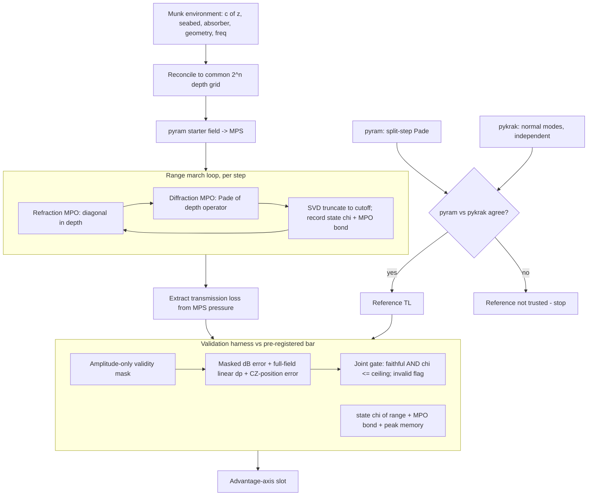

# feat: MPS parabolic-equation solver for ocean acoustic propagation (walking skeleton)

## Summary

Build a Python module that propagates an underwater acoustic field with a matrix-product-state (MPS) parabolic-equation (PE) range-marcher, and validates its transmission-loss field against `pyram` (a pure-Python RAM port) — cross-checked against `pykrak` normal modes — on the range-independent Munk deep-water benchmark. Bond dimension χ and the diffraction-operator MPO bond are instrumented; a validation harness reports faithfulness against a **pre-registered** bar (dB tolerance, amplitude-only validity mask, and a cost-anchored χ ceiling all fixed before the MPS path runs) and is built so an advantage axis plugs in next.

---

## Problem Frame

Underwater sound propagation is modeled by the parabolic equation, which marches the acoustic field forward in range by applying a depth-propagation operator each step. Representing the depth field as an MPS and applying that operator as a matrix-product operator with truncation could shrink the cost of large or 3-D domains — *if* the field stays low bond dimension. The research scan confirms MPS/tensor methods have been applied to the time-domain wave equation, 3-D parabolic heat equations, and Vlasov-Poisson, but **not** to the range-marched acoustic PE; whether a deep-water field (with convergence zones and caustics) stays low-χ is a genuinely open empirical question (see origin: `2026-06-19-tensor-network-ocean-acoustics-brainstorm.md`).

Two framing commitments make v1 honest rather than self-confirming:

- **Range-independent low-frequency Munk is the maximally-favorable regime** — no range-rank growth, smooth profile, few modes. A low-χ result here is *necessary but not sufficient*: it says nothing about the convergence-zone/caustic structure, higher frequencies, or 3-D where the method must eventually pay off. v1 can therefore **falsify** the core bet (high χ even here kills it) but cannot **confirm** it.
- **Faithfulness alone is not validation.** `pyram` runs the same split-step Padé algorithm the MPS marcher implements, so with loose truncation the MPS path reproduces RAM's field by construction — agreement at unbounded χ only proves SVD round-trips numbers. The result that matters is agreement *at a bounded, cost-competitive χ*, against a bar fixed before the data is seen.

The discipline this plan applies is exactly the prior ENSO learning: the guarantees that make a comparison trustworthy must be structural properties of the harness, the bar must be pre-registered, and an independent reference is required — see `docs/solutions/architecture-patterns/leakage-safe-sealed-evaluation-harness.md`.

---

## Requirements

**Solver and physics**
- R1. The system marches a 2-D parabolic-equation acoustic field forward in range with a split-step scheme on a range-independent environment (the range loop is inherent to the PE; per-range/range-dependent environments are deferred).
- R2. The acoustic field is represented as a matrix-product state over a power-of-two depth grid (QTT encoding) spanning the full vertical domain (water column + penetrable seabed + absorbing layer); each range step applies the depth-propagation operator as a matrix-product operator with SVD truncation to a cutoff.

**Reference and comparison**
- R3. Transmission loss (dB) is computed from the complex pressure field by a single shared function, normalized identically for the reference and MPS paths.
- R4. The MPS-PE result is validated against `pyram` on the range-independent Munk deep-water benchmark, on a common depth/range grid reconciled with the QTT axis.
- R5. The validity mask is defined **solely from the reference field amplitude** (bins a fixed dB below peak), fixed before comparison; the harness reports masked dB error (median and 95th-percentile |ΔTL|), a **full-field linear |Δp| error** (so masked-region disagreement stays visible), and a **convergence-zone-position error** (range error of the first several TL maxima, sensitive to phase drift truncation can hide).
- R10. `pyram` is cross-checked against `pykrak` normal modes on range-independent Munk and must agree before `pyram` is used as the MPS reference; both fields are recorded.

**Instrumentation and the bar**
- R6. State bond dimension χ(range), the diffraction-operator MPO bond dimension, and peak memory are instrumented and reported.
- R7. A sanity gate records an honest **joint** verdict — faithful within the pre-registered dB tolerance **and** peak χ at or below the pre-registered ceiling — with χ and faithfulness reported separately and an `invalid` flag for degenerate (NaN/empty) fields; it never silently passes.
- R9. The faithfulness bar — dB tolerance, amplitude-only validity mask, and the cost-anchored χ ceiling — is fixed before the MPS path runs; the result is reported as an accuracy-vs-χ curve, and the plan states that a low-χ pass in this favorable regime is necessary-not-sufficient.

**Extensibility**
- R8. The harness exposes a pluggable advantage-axis interface (compression/memory, χ-frontier, wall-clock) so a chosen axis runs without reworking the comparison.

---

## Key Technical Decisions

- **Reference baseline = `pyram`, independently cross-checked by `pykrak`.** `pyram` (pure-Python RAM v1.5 port, Numba, pip-installable) runs the same split-step Padé algorithm in-process — ideal for step-by-step comparison, but *same-family*: validating against it alone is circular. `pykrak` (pure-Python KRAKEN normal modes) is an **independent** method that is rock-solid on the range-independent Munk case; v1 requires `pyram` to agree with `pykrak` before treating `pyram` as the MPS reference (R10). (Alternative `pyat` wraps Fortran AT binaries — rejected for the build dependency.)
- **Pre-registered bar (the rigor move).** Before the MPS path runs, fix: the dB tolerance; the validity mask (reference-amplitude-only, a set dB below peak); and the χ ceiling, derived from the dense-grid crossover where MPS stops being cheaper than a dense solve (order `2·χ²·log₂(Nz) < Nz`). This prevents the post-hoc goalpost move that turns a null result into a movable target — the same pre-registration discipline as the ENSO sealed-partition learning. The exact numeric values are set against the published reference during implementation and recorded in the manifest, but they are fixed before the MPS comparison.
- **Faithfulness reported as accuracy-vs-χ, milestone is joint.** The headline is agreement within tolerance *at χ ≤ ceiling*; agreement at unbounded χ is reported explicitly as the trivial-reproduction control, not as success.
- **MPS/MPO engine = `quimb`** (`mps_gate_with_mpo_direct` / `tensor_network_1d_compress`, `max_bond`/`cutoff`, χ readout). The diffraction operator is a custom MPO with no library precedent; **both** state χ and the constructed MPO's bond dimension are instrumented, because per-step cost is `O(χ²·D_mpo²)` — a high-bond operator can dominate cost however compressible the field is. (Alternative `TeNPy` TEBD noted.)
- **Grid reconciliation.** `pyram` chooses its own depth grid (from `dz ≈ 0.1·1500/freq`, `zmax = seabed + ~20λ`), essentially never a power of two. The MPS path requires a 2ⁿ grid (QTT). Drive `pyram` with explicit `dz`/`zmax` kwargs to land its output on the common 2ⁿ axis over a shared extent, or interpolate both onto one canonical grid declared in the shared comparison code — decided in U3, tested in U2/U3.
- **Full vertical domain.** To match `pyram` step-for-step the MPS domain must cover water column + penetrable seabed + absorbing layer (RAM's `zmax = seabed + ~20λ`), not just the water column; the 2ⁿ site count is tied to total depth. The seabed (sound speed, density, attenuation, bathymetry) is part of the environment, not a complex-sound-speed afterthought.
- **Starter field taken from `pyram`.** RAM's self-starter is an implicit-solve procedure, not a closed form. The simplest faithful path encodes `pyram`'s computed initial field onto the MPS and marches, rather than re-deriving the self-starter in MPS form.
- **Range-independent Munk first.** v1 validates range-independent Munk only; range-dependence (stair-stepped environments, ASA wedge / SWAMP) and the per-range environment API are deferred. The marcher's range loop is inherent to the PE, so extending to range-dependence later is a localized change, not a v1 design surface.

---

## High-Level Technical Design

The field starts from `pyram`'s starter encoded as an MPS, marches in range through alternating compressed operators, and is read out as transmission loss; the harness compares against the `pyram` reference (itself cross-checked by `pykrak`) on a reconciled grid, against a pre-registered bar, feeding a joint sanity gate and the advantage-axis slot.



---

## Output Structure

A new sibling package `mps_acoustics/`, independent of the existing `qrc_enso/` (different domain, shared repo conventions).

```
pyproject.toml          # add optional extra: acoustics = [pyram, quimb, pykrak]
mps_acoustics/
  __init__.py
  environment.py        # U2  Munk profile, seabed, full vertical domain, geometry, grid sizing
  pe_reference.py       # U3  pyram TL + pykrak cross-check on a reconciled grid; shared TL fn
  mps_field.py          # U4  QTT encoding of the depth field; TL extraction
  propagator.py         # U5  split-step refraction + diffraction MPOs, march, state-chi + MPO-bond
  validation.py         # U6  masking, error metrics, pre-registered bar, joint gate, advantage-axis
  experiment.py         # U7  wire MPS-PE vs reference on Munk, report accuracy-vs-chi
tests/
  test_environment.py
  test_pe_reference.py
  test_mps_field.py
  test_propagator.py
  test_validation.py
  test_experiment.py
scripts/
  run_munk_validation.py
```

The per-unit `**Files:**` lists are authoritative; this tree is the expected shape, adjustable during implementation.

---

## Implementation Units

### U1. Scaffolding and the acoustics dependency extra

- **Goal:** Stand up the `mps_acoustics` package and an `acoustics` optional-dependency extra (`pyram`, `quimb`, `pykrak`) so later units have a home and an importable stack.
- **Requirements:** Enables R1–R10.
- **Dependencies:** none.
- **Files:** `pyproject.toml` (add `acoustics` extra), `mps_acoustics/__init__.py`, `tests/test_smoke.py`.
- **Approach:** Add `acoustics = ["pyram", "quimb", "pykrak"]` alongside existing project metadata. `pykrak` is a v1 dependency (the independent reference, R10), not deferred. Keep module files as typed stubs the later units fill in; mirror the existing repo layout (flat package, pytest, lazy heavy imports).
- **Patterns to follow:** the `qrc_enso` package layout and `pyproject.toml` optional-extra style (`quantum`, `dev`).
- **Test scenarios:** A smoke test imports every `mps_acoustics` module and asserts `pyram`, `quimb`, and `pykrak` import. `Test expectation: none for behavior -- scaffolding only; the smoke import guards the environment.`
- **Verification:** `pip install -e ".[acoustics,dev]"` succeeds and the smoke test passes.

### U2. Munk environment, seabed, and full vertical domain

- **Goal:** Define the Munk profile, the seabed and absorbing layer, the full vertical domain, and the geometry the solvers consume — sized for both `pyram` and the QTT grid.
- **Requirements:** R1, R2, R4.
- **Dependencies:** U1.
- **Files:** `mps_acoustics/environment.py`, `tests/test_environment.py`.
- **Approach:** Implement the analytic Munk profile c(z) = c₁[1 + ε(η + e^(−η) − 1)], η = 2(z − z_axis)/B with the canonical constants. Carry the seabed parameters `pyram` requires (sound speed, density, attenuation, bathymetry/water depth) matching the Computational Ocean Acoustics Munk bottom, plus the absorbing-layer width in wavelengths. The vertical domain spans water + seabed + absorber (`zmax ≈ seabed + ~20λ`); the depth grid is a power of two over that *total* extent (QTT requirement) and is the common axis the reference is reconciled to (U3). The environment is range-independent; no per-range API in v1.
- **Patterns to follow:** `qrc_enso` config/dataclass style; Munk + bottom parameters from Computational Ocean Acoustics (2nd ed.) / the Acoustics Toolbox manual; `pyram`'s required seabed inputs (`z_sb`, `cb`, `rhob`, `attn`, `rbzb`).
- **Test scenarios:**
  - The Munk profile has its sound-speed minimum at the channel axis and increases above and below (assert axis is argmin); c(z) matches hand-computed values at the axis and one off-axis depth.
  - The environment exposes the full seabed parameter set `pyram` needs; absence of any required seabed field is rejected.
  - The depth grid is a power of two and spans water + seabed + absorber (assert `zmax ≥ seabed + absorber width`); a non-power-of-two or water-column-only domain is rejected.
  - Source/receiver depths and range extent round-trip through the environment object.
- **Verification:** A Munk environment instantiates with seabed + absorber, reproduces the textbook profile, and exposes a power-of-two full-domain depth axis.

### U3. Reference TL: pyram cross-checked by pykrak, on a reconciled grid

- **Goal:** Produce a trusted reference TL field — `pyram` driven onto the common 2ⁿ grid and independently cross-checked against `pykrak` normal modes — and define the shared TL computation.
- **Requirements:** R3, R4, R10.
- **Dependencies:** U2.
- **Files:** `mps_acoustics/pe_reference.py`, `tests/test_pe_reference.py`.
- **Approach:** Map the U2 environment (incl. seabed) to `pyram`'s arguments and drive it with explicit `dz`/`zmax` (and range) kwargs so its output lands on the common 2ⁿ depth axis over the shared extent — or interpolate onto a single canonical grid declared here. Compute `pykrak` normal-mode TL on the same range-independent Munk case. Implement the shared TL function (TL = −20·log₁₀|p|, normalized to the reference distance) once, used by reference and MPS paths. Expose a `references_agree` check (pyram vs pykrak within a stated dB tolerance over the amplitude-masked region); the MPS comparison must not proceed if they disagree. Isolate all `pyram`/`pykrak` calls here.
- **Patterns to follow:** lazy heavy-import isolation as in `qrc_enso/qrc.py`; `pyram` `run()` TL-grid output and `pykrak` mode API per their docs.
- **Test scenarios:**
  - Covers R4. `pyram`'s output grid coincides with the U2 2ⁿ depth axis over the shared extent (or the canonical-grid interpolation maps both onto identical axes — assert axis equality).
  - Covers R10. On range-independent Munk, `pyram` and `pykrak` TL agree within tolerance over the amplitude-masked region; a deliberately mismatched environment makes `references_agree` return False.
  - The reference TL curve shows the expected deep-water convergence-zone structure (periodic maxima), not monotonic decay.
  - Covers R3. The shared TL function maps a known complex pressure to the hand-computed dB value; reference and a hand-normalized pressure agree.
  - Re-running the reference reproduces an identical field (determinism).
- **Verification:** A reference TL field is produced on the common grid and `pyram`-vs-`pykrak` agreement is confirmed before it is used downstream.

### U4. MPS depth-field representation and TL extraction

- **Goal:** Encode the full-domain depth field as an MPS (QTT) and extract transmission loss back from it.
- **Requirements:** R2, R3.
- **Dependencies:** U2, U3.
- **Files:** `mps_acoustics/mps_field.py`, `tests/test_mps_field.py`.
- **Approach:** Encode a depth-sampled complex field as a `quimb` MPS over log₂(Nz) sites (Nz the full-domain power-of-two grid from U2); provide encode (dense → MPS at a cutoff) and decode (MPS → dense), and a TL extractor using the shared U3 TL function. Expose state bond dimension χ. Keep `quimb` calls isolated here.
- **Patterns to follow:** `quimb` MPS construction + `tensor_network_1d_compress`; adapter-isolation pattern from `qrc_enso/qrc.py`.
- **Test scenarios:**
  - A smooth analytic field (a few low-order depth modes) encodes to low χ and decodes within the cutoff tolerance; a random per-depth field requires high χ to round-trip (χ reflects field structure).
  - Reported χ equals the actual maximum MPS bond dimension.
  - TL extracted from the MPS equals TL of the decoded dense field (extractor consistency).
- **Verification:** Encode/decode round-trips a smooth field at low χ with a correct χ readout.

### U5. Split-step MPS-PE propagator

- **Goal:** March the MPS field in range with refraction and diffraction MPOs and truncation, instrumenting both state χ and the diffraction-MPO bond — the solver core.
- **Requirements:** R1, R2, R6.
- **Dependencies:** U2, U4.
- **Files:** `mps_acoustics/propagator.py`, `tests/test_propagator.py`.
- **Approach:** Encode `pyram`'s computed starter field onto the MPS (per the KTD — do not re-derive the self-starter). Build the refraction operator (diagonal in depth, pointwise phase from the local index) as a diagonal MPO, and the diffraction operator (Padé/rational approximation of the depth operator, mirroring RAM's split-step Padé) as an MPO; record the constructed diffraction-MPO bond dimension. March: refraction, diffraction, truncate to cutoff, record state χ(range), repeat, over the full vertical domain with the seabed/absorber index profile. Expose the field over (depth × range) for TL extraction.
- **Execution note:** Validate one range step against a dense (non-MPS) split-step reference before trusting the marched field — an operator or truncation off-by-one is otherwise invisible.
- **Patterns to follow:** RAM split-step Padé structure (Collins 1993); the Vlasov-Poisson TT split-step (arXiv:2602.13092) for alternating compressed operators; `quimb` MPO-apply-then-compress.
- **Test scenarios:**
  - Covers R1. On a homogeneous (constant-c, no bottom interaction) sub-domain, the marched field matches analytic free-field spreading over a short range.
  - A single range step of the MPS marcher matches a dense split-step step on the same field within the truncation tolerance.
  - Covers R6. Both state χ(range) and the diffraction-MPO bond are recorded every step; the MPO bond is bounded (a test asserts it does not grow unbounded with Nz), and a tighter cutoff yields larger state χ at fixed accuracy (monotone trade-off).
  - The `pyram` starter encodes correctly and the absorbing bottom suppresses energy rather than reflecting it (no spurious upward return).
  - Marching is deterministic for a fixed cutoff and environment.
- **Verification:** The marcher reproduces free-field spreading on a homogeneous case and matches a dense split-step step, with state χ and MPO bond instrumented.

### U6. Validation harness, pre-registered bar, joint gate, advantage-axis slot

- **Goal:** Compare the MPS-PE TL field against the reference against a pre-registered bar, report the full metric set and instrumentation, gate jointly and honestly, and expose the advantage-axis interface.
- **Requirements:** R5, R6, R7, R8, R9.
- **Dependencies:** U3, U5.
- **Approach:** Define the validity mask **solely from the reference field amplitude** (bins a fixed dB below peak), fixed before comparison and identical for both fields. Compute: masked dB error (median and 95th-percentile |ΔTL|), a full-field **linear |Δp|** error (so masked-region disagreement stays visible), and a **convergence-zone-position error** (range error of the first several TL maxima). Surface state χ(range), the diffraction-MPO bond, and peak memory. The faithfulness bar (dB tolerance, mask threshold, χ ceiling from the dense-crossover) is supplied pre-registered (R9). The joint sanity gate records faithful (within tolerance) AND peak χ ≤ ceiling, with faithfulness and χ reported separately and an `invalid` flag for degenerate fields — never a silent pass; it also records the unbounded-χ agreement as the trivial-reproduction control. Define an `AdvantageAxis` protocol (no concrete axis in v1).
- **Patterns to follow:** `qrc_enso/experiment.py` sanity-gate + `qrc_enso/evaluation.py` `AdvantageAxis` protocol; the harness-invariant / pre-registration discipline in `docs/solutions/architecture-patterns/leakage-safe-sealed-evaluation-harness.md`.
- **Test scenarios:**
  - Covers R5. Two TL fields differing by a known constant dB offset yield that offset; identical fields yield zero; the mask is computed from the reference amplitude alone (assert masked bins are exactly those below the peak-relative threshold, independent of the MPS field).
  - Covers R5. A field that agrees on amplitude but has shifted CZ maxima produces a nonzero CZ-position error (the metric catches phase drift the masked dB stats miss).
  - Covers R7/R9. A run faithful within tolerance but with peak χ above the ceiling fails the joint gate (χ check fails) while faithfulness is still reported; a degenerate (NaN/all-zero) field records `invalid` and fails.
  - Covers R8. A caller-supplied one-method advantage-axis object round-trips through the harness without modifying harness internals.
- **Verification:** The harness reports the full metric set + instrumentation and an honest joint verdict on constructed inputs.

### U7. Munk validation experiment and script

- **Goal:** Wire the MPS-PE through the harness against the cross-checked reference on Munk, against the pre-registered bar, and report accuracy-vs-χ — the walking-skeleton milestone.
- **Requirements:** R4, R5, R6, R7, R9, R10.
- **Dependencies:** U6.
- **Files:** `mps_acoustics/experiment.py`, `scripts/run_munk_validation.py`, `tests/test_experiment.py`.
- **Approach:** Pre-register the dB tolerance, amplitude-mask threshold, and χ ceiling (recorded in the manifest before the MPS run). Confirm `pyram`-vs-`pykrak` agreement (R10) first; only then run the MPS-PE marcher and push both through the harness. Report TL-vs-range, the full metric set, an **accuracy-vs-χ curve** (error as a function of the truncation cutoff / resulting χ), state χ(range), MPO bond, peak memory, and the joint verdict to a results manifest. The script is the human entry point; the experiment function is the tested core.
- **Patterns to follow:** `qrc_enso/experiment.py` runner + manifest; `scripts/run_baseline_experiment.py` script shape.
- **Test scenarios:**
  - Covers R10. The experiment refuses to report an MPS verdict if `pyram` and `pykrak` disagree on the reference.
  - Covers R4/R9. With a cutoff that keeps χ at or below the pre-registered ceiling, the MPS-PE TL error against `pyram` is within the pre-registered tolerance over the amplitude-masked region (the joint faithfulness milestone); the manifest records the pre-registered bar and the accuracy-vs-χ curve.
  - Covers R7. A run that only achieves tolerance at χ above the ceiling records a non-faithful (trivial-reproduction) verdict, not success.
  - Re-running with the same settings reproduces identical reported numbers.
- **Verification:** `scripts/run_munk_validation.py` produces the TL comparison, accuracy-vs-χ curve, instrumentation, and an honest joint verdict on the Munk case.

---

## Scope Boundaries

### Deferred for later
- **Range-dependent benchmarks and the per-range environment API** — stair-stepped environments and the ASA wedge / SWAMP cases. The range loop is inherent to the PE; the per-range environment surface is built only when the range-dependent benchmark unit is written.
- **Advantage axis** — committing to and running compression-memory vs χ-frontier vs wall-clock. U6 ships the interface; the chosen axis lands with follow-on work.
- **Higher frequencies and 3-D** — the frequency sweep (where χ is expected to grow) and 3-D PE (where compression could pay most) are the frontier, not v1.

### Deferred to follow-up work
- Wall-clock optimization of the MPS marcher (e.g. successive randomized compression for the MPO-MPS product). v1 establishes faithfulness at a bounded χ, not speed.

---

## Risks and Dependencies

- **The core bet may not hold — χ could grow in deep water.** Convergence zones, caustics, and Lloyd-mirror interference may drive state χ high, and v1 is the *maximally-favorable* regime, so a high-χ result here falsifies the bet. χ(range) against the pre-registered ceiling is the instrument; a high-χ finding is a result, not a failure.
- **The diffraction operator's MPO bond may dominate cost.** The advantage rests on the *state* staying low-χ, but per-step cost is `O(χ²·D_mpo²)`; a Padé operator involving a banded inverse can have high MPO bond. v1 instruments the MPO bond (U5/R6); if it is high, the competitiveness verdict must account for it and a fallback (compress the MPO, or a transformed basis) is documented.
- **Same-family / circular reference.** `pyram` and the MPS marcher share the PE Padé operator, so agreement could reflect a shared approximation. Mitigation: the independent `pykrak` normal-mode cross-check is a required v1 gate (R10).
- **Validity-mask gerrymandering.** Masking interference nulls could hide disagreement exactly where χ is most stressed. Mitigation: the mask is reference-amplitude-only and fixed before comparison, and a full-field linear |Δp| plus a CZ-position metric keep masked-region and phase-drift disagreement visible (R5).
- **The MPS-PE adapter is substantial custom code.** No PDE-on-MPS library exists; the Padé diffraction MPO, starter encoding, and absorber handling are built on `quimb`. Mitigation: isolate behind `propagator.py`; validate a single step against a dense split-step (U5 execution note).
- **`pyram` / grid match.** `pyram` is a community port and picks its own grid; v1 reconciles grids explicitly (U3) and gates on the `pykrak` cross-check before trusting it.
- **QTT depth-grid constraint and PE one-way limitation.** The full-domain depth grid must be a power of two (U2 enforces it); the parabolic equation ignores backscatter — a stated modeling boundary for deep-water forward propagation, not a defect.

---

## Sources / Research

- `pyram` — pure-Python RAM v1.5 port (Numba), reference PE solver; exposes a TL grid. Note: `pyram` requires seabed inputs and picks its own grid (reconciliation needed).
- `pykrak` — pure-Python KRAKEN normal modes; the independent reference for range-independent Munk (R10).
- `quimb` — MPS/MPO compression (`mps_gate_with_mpo_direct`, `tensor_network_1d_compress`, `max_bond`/`cutoff`); confirmed to expose the needed interfaces.
- Munk deep-water benchmark + bottom parameters — Computational Ocean Acoustics (Jensen, Kuperman, Porter, Schmidt, 2nd ed., 2011) and the Acoustics Toolbox manual.
- RAM split-step Padé PE and self-starter — Collins, JASA 1993 (the algorithm `pyram` and the MPS marcher both implement).
- Quantum-inspired wave-equation MPS — arXiv:2504.11181 (field-as-MPS, MPO evolution, QTT encoding).
- TT split-step for Vlasov-Poisson — arXiv:2602.13092 (alternating diagonal + spectral operators in compressed form; closest structural analog).
- Low-rank TT finite difference for 3-D parabolic equations — arXiv:2509.10142.
- Pre-registration / harness-invariant / independent-reference discipline — `docs/solutions/architecture-patterns/leakage-safe-sealed-evaluation-harness.md`.
